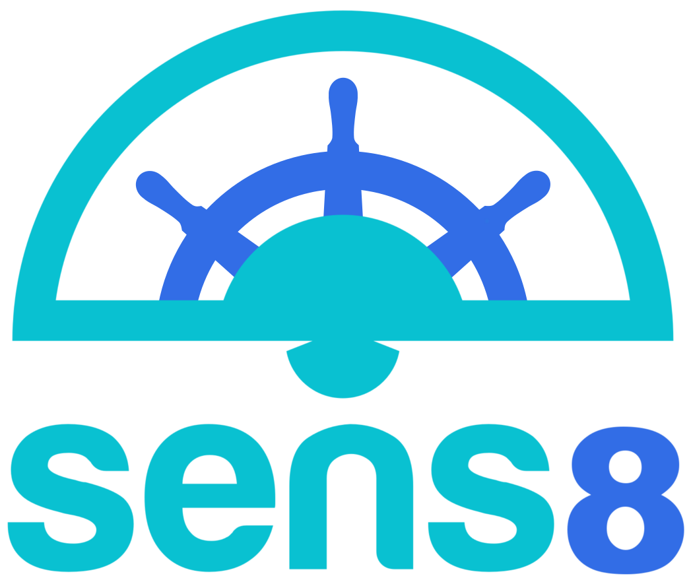

**Sensu + K8s**

A Kubernetes controller that watches cluster resources (`Deployment`, `Pod` etc.) and runs Sensu checks which are declared in the resource's annotations. For each of the check definitions it will run them at the specified interval updating the checks with the latest resource info provided by Kubernetes. It communicates directly to Sensu's RabbitMQ endpoint dynamically adding Sensu [proxy clients](https://sensuapp.org/docs/latest/reference/clients.html#proxy-clients) and optionally removing them on resource deletion or annotation update.   

Sens8 effectively acts a Sensu super client. It allows for checks to be run on ephemeral resources such as a pod under a replicaset without having to sidecar the heavy Sensu ruby client, or restart it. By having checks defined in the resources themselves it gives teams greater autonomy and lets checks be pushed out via CD. It also prevents having to manage resource level checks out of band via configuration management. 

Unlike a traditional setup where Sensu's client is installed with check scripts, only a predefined number of checks are supportd (ie, only check definitions are allowed in the annotations). Refer to the check schema below for valid check types for each resource. Most checks are intended to be run over the network - like making an http request to a pod. For resources such as deployments, only checks based on the status provided by Kubernetes are possible.
       
A keepalive is run for Sens8 itself, and only itself since all other checks register under proxy clients. Given its super client nature it's advised to set up alerting/paging appropriately.   

### Build

```bash
make all
```

### Deployment

Refer to `kubernetes.yml` for an example deployment + config

### Limitations

* Only RabbitMQ transport is supported (no Redis)
* If Sens8 crashes all checks that have a ttl will alert
* Subscriptions are ignored
* Only checks are run. No metrics 
* Certain resources types such `Deployment` have a limited feature set and only alert of the status provided by Kubernetes. 

### Roadmap

* Implemented resource controllers
  - [x] Deployment
  - [x] Pod
  - [ ] Service
  - [ ] ReplicaSet
  - [ ] Node
  - [ ] DaemonSet
* Generic checks: exec, http status code, etc.
* Configure which resource controllers are to run. 
* HA deployment. Run a subset of checks per sens8 instance.
* Simple stats to list currently running checks.
* Silence all checks. Macro functionality for maintenance, or when fit hits shan.  


Check Schema
============

Checks are defined in the annotation `hootsuite.com/sensu-checks` of a given resource as a json array check objects. The check format is same as Sensu's [check configuration](https://sensuapp.org/docs/0.29/reference/checks.html#check-attributes) minus some fields being ignored. Refer to Sensu's [check definition specification](https://sensuapp.org/docs/0.29/reference/checks.html#check-definition-specification) as a guide.

| field       | type    | required | example                             |description |
|-------------|---------|----------|-------------------------------------|------------|
| name        | string  | *        | `my_check`                          | Name of the check. Must be unique to the resource it's running on. See [Check naming](https://sensuapp.org/docs/0.29/reference/checks.html#check-names) |
| command     | string  | *        | `deployment_health --tolerance 0.8` | Check to run. The first thunk of the string is the check id. All other parameters get parsed depended on the check itself. Environment variables and backticks (sub-shells) are interpolated |
| interval    | int     | *        | `30`                                | Interval in seconds to run the check |
| deregister  | bool    |          | `true`                              | Deregister the proxy client sensu on resource deletion or annotation removal. Default value is dependant on resource type. Pod: true, Deployment: false |

All other (arbitrary) fields get passed along with the check result in the same way Sensu client proper does.

Check results will be registered/de-registered with the following template:  

| Resource   | Source (client name)                     | Derregister default |
|------------|------------------------------------------|---------|
| Deployment | `deployment-name.deployment.namespace`   | `false` | 
| Pod        | `pod-name.pod.namespace`                 | `true` | 
| Service    | `sevice-name.service.namespace`          | `false` | 
| ReplicaSet | `replicatset-name.replicatset.namespace` | `false` |
| Node       | `node-name.node.namespace`               | `false` |
| DaemonSet  | `daemonSet-name.daemonSet.namespace`     | `false` |

**Example check annotation**
```json
[
  {
    "name": "deployment_health",
    "command": "deployment_health --tolerance 0.8",
    "interval": 60,
    "deregister": true,
    "foo": "bar"
  }
]
```

**Example check result**

For the given check example above, the check result to Sensu might look like:
```json
[
  {
    "name": "deployment_health",
    "command": "deployment_health --tolerance 0.8",
    "interval": 60,
    "deregister": true,
    "foo": "bar",
    "source": "test-app.deployment.default",
    "status": 0,
    "output": "replicas: 5, updatedReplicas: 5, unavailableReplicas: 0"
  }
]
```

## Defaults

It is possible to set defaults for all checks in Sens8's `-config-file` config. Arbitrary fields are respected, but any field defined in the check will override. It is also possible to set a default for the required `interval`. Example:

```json
{
  "defaults": {
    "interval": 60,
    "occurrences": 3,
    "refresh": 900,
    "handlers": ["default"],
    "pager_team": "production_engineering"
  }
}
```

## Example service deployment

```yaml
kind: Deployment
apiVersion: extensions/v1beta1
metadata:
  labels:
    app: test-app
  name: test-app
  namespace: default
  annotations:
    hootsuite.com/sensu-checks: |-
      [
        {
          "name": "deployment_health",
          "command": "deployment_health --tolerance 0.8",
          "interval": 60,
          "occurrences": 3,
          "refresh": 900,
          "handlers": ["default"],
          "pager_team": "team_production_delivery",
          "documentation": "http://example.com/runbook.html",
          "deregister": true
        }
      ]
spec:
  replicas: 1
  revisionHistoryLimit: 1
  selector:
    matchLabels:
      app: test-app
  template:
    metadata:
      labels:
        app: test-app
      annotations:
        hootsuite.com/sensu-checks: |-
          [
            {
              "name": "check_pod_dependencies",
              "command": "hs_healthcheck --url http://:::POD_IP::::80/status/dependencies",
              "interval": 60,
            }
          ]
    spec:
      containers:
      - name: test-app
        image: markeijsermans/debug
        command: ["python3"]
        args: ["-u", "-m", "http.server", "80"]
        imagePullPolicy: Always
        ports:
        - containerPort: 80
          protocol: TCP
```


Checks
======

@todo - generate these docs from the checks flags.


### `deployment_health`
valid resources: `Deployment`

- `deployment_health --tolerance [HEALTH_TOLERANCE]`. HEALTH_TOLERANCE is the percent of minimum healthy nodes required (0.0 - 1.0)    

**Example**

```json
[
  {
    "name": "deployment_health",     
    "command": "deployment_health --tolerance 0.6",
    "interval": 60
  }
]
```
Result
```json
{
  "name": "deployment_health",
  "command": "deployment_health --tolerance 0.6",
  "interval": 60,
  "source": "foo.deployment.default",
  "status": 0,
  "output": "replicas: 5, updatedReplicas: 5, unavailableReplicas: 0"
}
```

### `hs_healthcheck`
valid resources: `Pod`, `Service`
